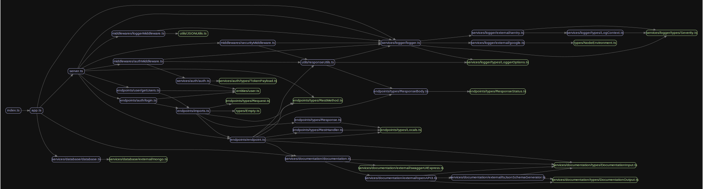

# Node-Starter-TS

[](https://996.icu)


Node.js starter package written in Typescript.

#### Features

-   Code quality:
    -   Pre-commit hook:
        -   ESLint check
        -   Prettier formatting
    -   Auto generated OpenApi-3 documentation
        -   ts-json-schema-generator: converts interfaces into JSON Schema Docs.
        -   openapi3-ts: enables writing type safe docs.
        -   swagger-ui-express: servers basic UI for the documentation.
-   Database:
    -   MongoDB w/ mongodb
-   Security:
    -   JWT: basic auth mechanism
    -   Sentry: error logging
    -   Google Cloud logging: info logging

## Start

```TypeScript
npm run docker:start
npm start
```

## Stop

```TypeScript
npm run docker:stop
```

#### Dependecy Graph


